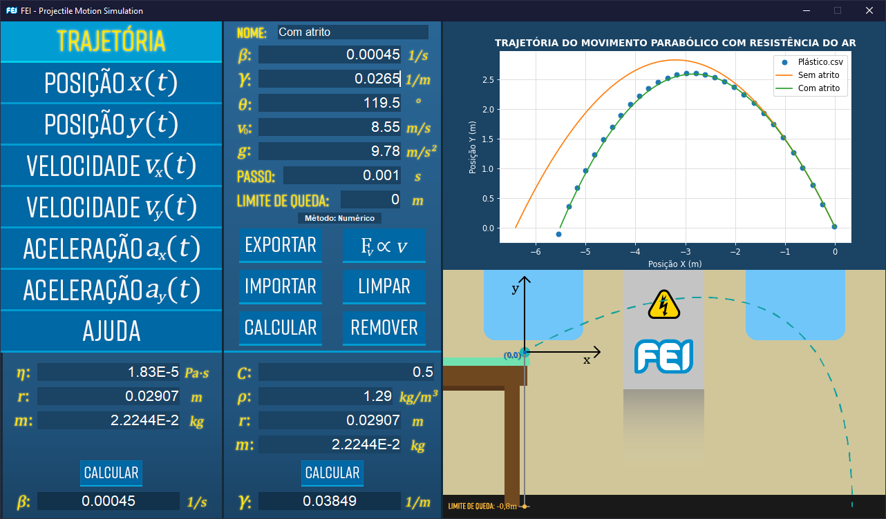

# **FEI Projectile Motion Simulation**

## **Introdução**

Este é o repositório oficial do projeto de iniciação didática realizado pelo aluno Rafael Zacarias Palierini e orientadora Eliane de Fátima Chinaglia com apoio do [Centro Universitário FEI](https://portal.fei.edu.br/).

Este projeto tem como objetivo melhorar as aulas de laboratório de Física I para o estudo do movimento balístico através da simulação desenvolvida.

## **Sumário**

[Introdução](#Introdução)

[Simulação](#Simulação)

[Instalação](#Instalação)

[Atualização](#Atualização)

[Manual](#Manual)

[FAQ (Perguntas Frequentemente Feitas)](#faq-perguntas-frequentemente-feitas)

## **Simulação**

Na simulação é possível calcular a trajetória do movimento e as seguintes grandezas cinemáticas:

* Posição x(t)
* Posição y(t)
* Velocidade vₓ(t)
* Velocidade vᵧ(t)
* Aceleração aₓ (t)
* Aceleração aᵧ (t)

Também é possível calcular os parâmetros de resistência do ar β e ɣ. Sendo β o parâmetro de atrito proporcional à velocidade e ɣ o parâmetro de atrito proporcional à velocidade quadrada.

Cada trajetória calculada resulta em um plotagem de um gráfico demonstrando a trajetória do movimento assim como também é plotado os gráficos de todas as outras grandezas cinemáticas em seus respectivos gráficos.

Para alternar entre os gráficos, basta selecionar através dos botões do lado esquerdo da simulação. Isto irá mostrar o gráfico desejado e também irá alternar os parâmetros necessários para calcular a opção selecionada.

No gráfico é possível dar e remover zoom com o scroll do mouse. Também é possível arrasta-lo para uma melhor análise apenas clicando no gráfico com o botão esquerdo do mouse e arrastando.

## **Instalação**

Requisitos:
- Windows 10
- Anaconda Navigator 1.9.12
- Mínimo de 256 MB de RAM (Quanto mais RAM, mais plotagens podem ser feitas)

Primeiro é necessário clonar o repositório do GitHub. Caso seja sua primeira vez no GitHub e não saiba como fazer isso, basta clicar no botão verde visto no começo da página e então clicar em Download ZIP como demonstra na imagem abaixo.

  

Isso irá baixar um arquivo .zip com uma pasta com o nome do repositório. Dentro da pasta estão todos os arquivos da simulação. Coloque a pasta *Simulation* (ou *first_release* se for utilizar a primeira versão) em algum lugar de fácil acesso como por exemplo a pasta Documentos de seu computador.

Para utilizar, recomenda-se baixar o [Anaconda](https://www.anaconda.com/products/individual) pois ele já vem pré-instalado com todas as bibliotecas utilizadas na simulação.

Com o [Anaconda](https://www.anaconda.com/products/individual) instalado, abra o Anaconda Navigator e a seguinte tela deverá ser vista:

Em seguida abra o Jupyter Notebook, isso irá abrir o seu navegador e é totalmente normal. Pois, o Jupyter Notebook utiliza o seu navegador como interface de navegação de arquivos e para a programação de scripts em Python.

Com Jupyter Notebook aberto, é preciso observar que ele sempre abre no diretório root(raiz) do seu usuário. Muito provavelmente pastas como Documentos, Imagens, Vídeos e Músicas estarão com seus nomes em inglês. Porém, elas se referem a mesma pasta que você utiliza diariamente no seu explorador de arquivos.

Em seguida, vá até a pasta da simulação. Nela, você verá o arquivo *Simulation.ipynb*. Clique nele para abrir o código da simulação.

Ao clicar, uma nova aba em seu navegador deverá ser aberta. Essa nova aba deve ser parecida com está:

Está é a tela do código do projeto, para rodar o código, basta clicar no botão , isso irá abrir um pop-up perguntando se você quer reiniciar o Kernel e rodar todas as células, clique no vermelho da imagem abaixo.

Pode ser que a simulação demore um pouco para abrir dependendo do computador, mas ela irá abrir e você verá a seguinte janela em seu computador.

Agora basta utilizar a simulação.

## **Atualização**

Caso haja dúvidas se surgiu alguma atualização da simulação, basta clicar no botão de ajuda e então clicar no ícone do GitHub. Você será redirecionado para está página e poderá verificar quando foi a última atualização.

## **Manual**

[Em desenvolvimento...]

No momento está sendo feito um Manual explicando como utilizar a simulação por completo. O relatório final do projeto explica como utiliza-la. Porém, o Manual deve torna-lo mais acessível para quem busca uma informação mais direta sobre a utilização da simulação.

## **FAQ (Perguntas Frequentemente Feitas)**

* **Posso utilizar em algum outro sistema operacional sem ser Windows?**

    **R:** O projeto foi desenvolvimento completamente utilizando Windows 10. Qualquer tentativa de roda-lo em outro sistema operacional não é garantido de funcionar. Contudo, uma versão para Linux é planejada para ser lançada futuramente.

---

* **Existem planos de alguma versão mobile?**

    **R:** No momento não.

---

* **Posso modificar o código da simulação?**

    **R:** Você pode clonar o repositório e fazer as alterações no seu código baixado. Qualquer alteração no código principal da simulação deve ser consultado e aprovado por mim.

---

* **Em caso de atualização, como posso utilizar uma versão anterior?**

    **R:** O projeto sempre manterá a primeira versão de lançamento disponível para o público na pasta **first_release**. Porém, todas as outras versões que vierem a ser lançadas poderão ser baixadas através do próprio GitHub, graças ao controle de versão.

---

* **Minha dúvida não está aqui, o que eu devo fazer?**

    **R:** Clique na aba de Issues do repositório do projeto e crie um novo Issue, eu responderei o mais rápido possível.
